# 🐾 VetCare - Sistema de Gestión de Citas Veterinarias

VetCare es una plataforma web full-stack diseñada para optimizar la gestión de consultas, mascotas y control administrativo de una clínica veterinaria. Este proyecto implementa una arquitectura moderna basada en microservicios contenerizados y enrutamiento SPA avanzado Detrás de un servidor proxy Nginx.

---

## 🚀 Características Clave

* **Autenticación Híbrida:** Login flexible mediante correo electrónico o número telefónico con encriptación segura (`bcrypt`).
* **Control de Roles:** Vistas y paneles completamente segregados para Administradores (`ADMIN`) y Usuarios finales (`USER`).
* **Gestión de Mascotas y Citas:** CRUD completo con soporte para subida de imágenes de pacientes organizadas en directorios dinámicos en el servidor.
* **Dashboard Estadístico:** Gráficas de monitoreo mensual e histórico de especies registradas mediante consultas optimizadas a la base de datos.

---

## 🛠️ Stack Tecnológico

* **Frontend:** Angular 21 (TailwindCSS, TypeScript, FormsModule)
* **Backend:** FastAPI (Python 3.14-slim, Uvicorn, Pydantic, PyMySQL, Bcrypt)
* **Base de Datos:** MariaDB
* **Proxy Web:** Nginx (Configuración personalizada con enrutamiento de fallback `try_files`)
* **Orquestación:** Docker & Docker Compose

---

## 🖼️ Capturas de Pantalla (Interfaz de Usuario)

### 🔑 Autenticación y Acceso
| Inicio de Sesión | Registro de Usuarios |
| :---: | :---: |
| 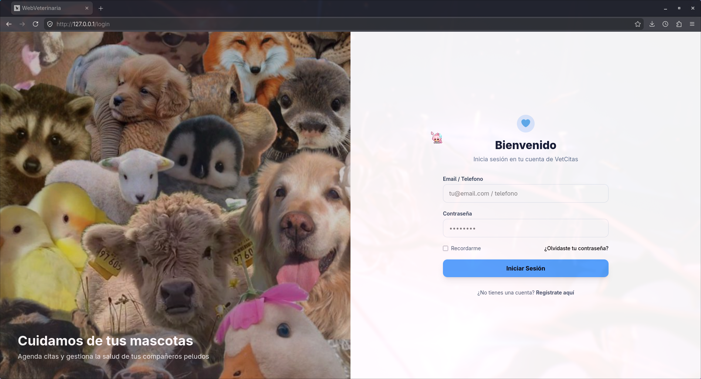 | 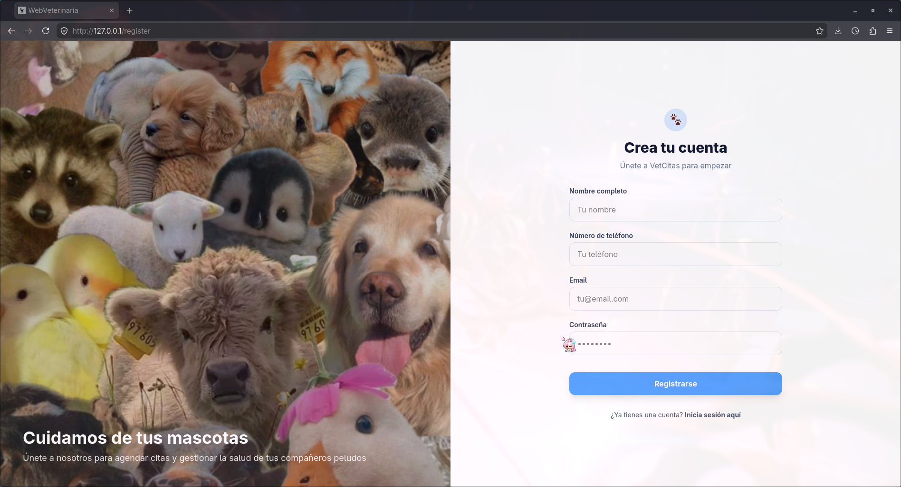 |

### 🏠 Vista Principal
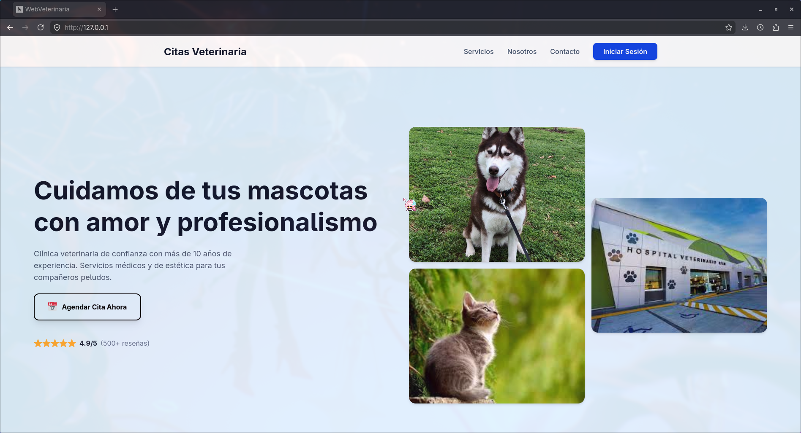

### 🧑‍💻 Panel de Clientes (Módulos de Usuario)
| Mi Dashboard | Mis Mascotas |
| :---: | :---: |
| 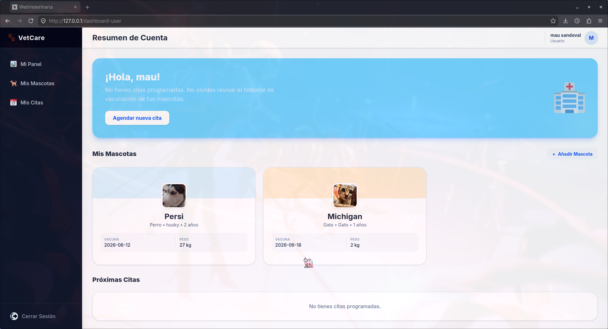 | 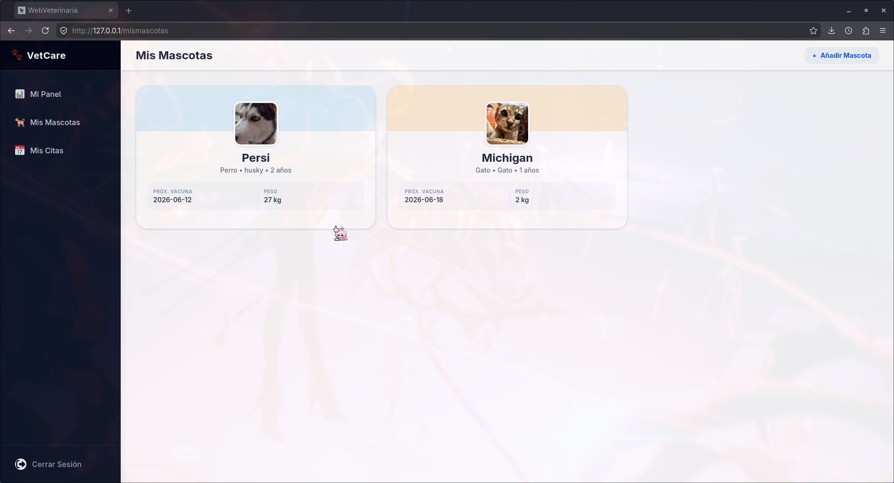 |

| Gestión de Citas | Registro de Mascotas (Modal) |
| :---: | :---: |
| 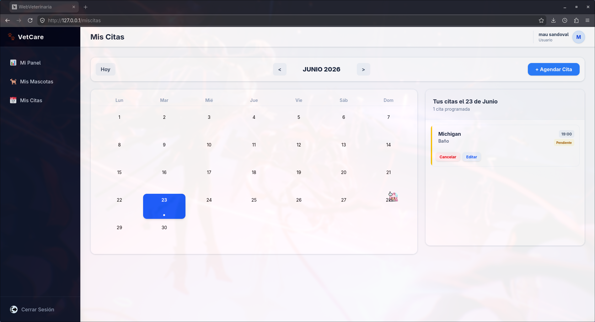 | 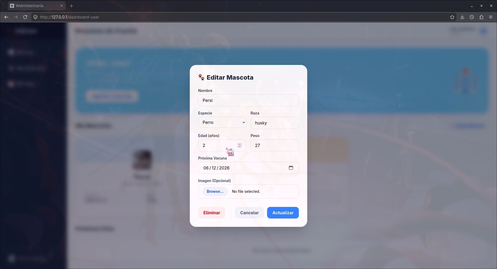 |

### 👑 Panel de Control (Módulos de Administrador)
| Métricas Generales | Calendario Global de Citas |
| :---: | :---: |
| 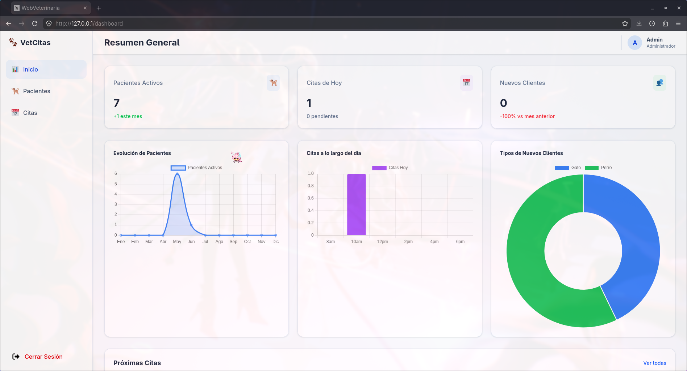 | 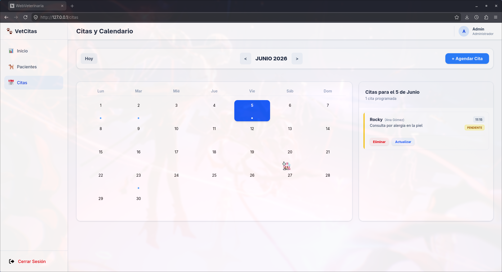 |

| Control de Pacientes | Modales de Acción |
| :---: | :---: |
| 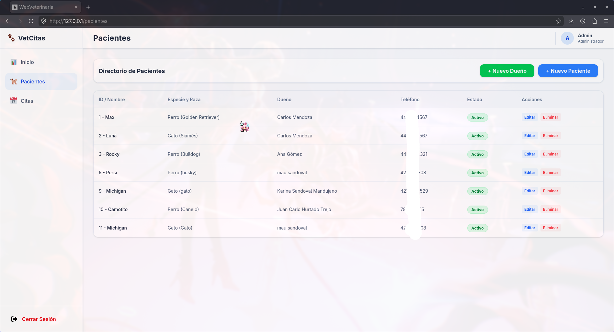 | 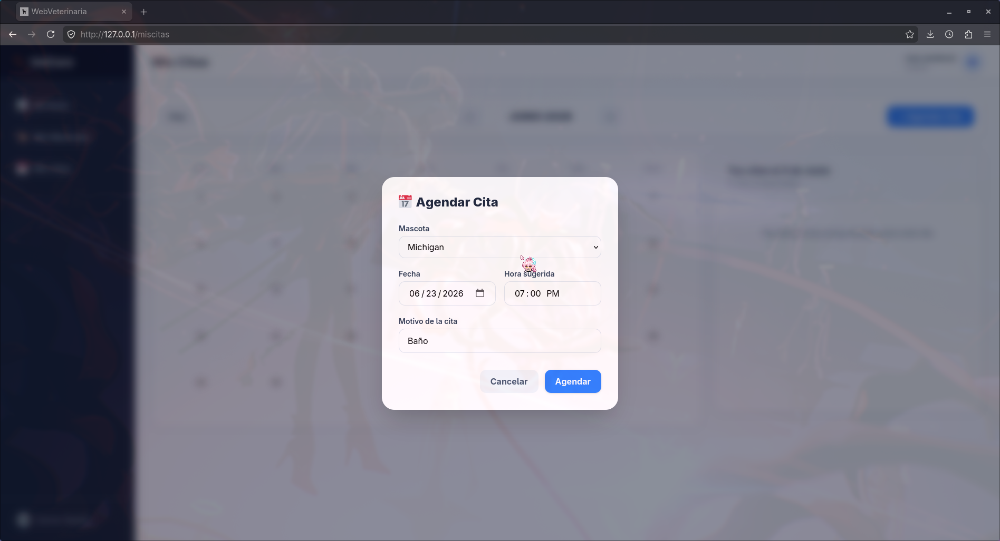 |

---

## 📦 Despliegue en Producción (Docker)

El proyecto está completamente contenerizado, aislando el Frontend, la API y la Base de Datos en una red interna y segura de Docker.

### Requisitos Previos
* Docker y Docker Compose instalados.

### Instrucciones de Lanzamiento

1. **Clonar el repositorio:**
   ```bash
   git clone [https://github.com/DMau1420/web_veterinaria.git](https://github.com/DMau1420/web_veterinaria.git)
   cd web_veterinaria
```
2. **Lanzar el contenedor:**
  ```bash
  docker compose up --build
  ```
